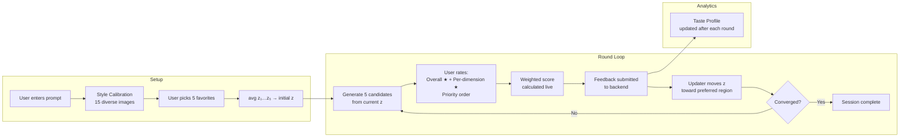
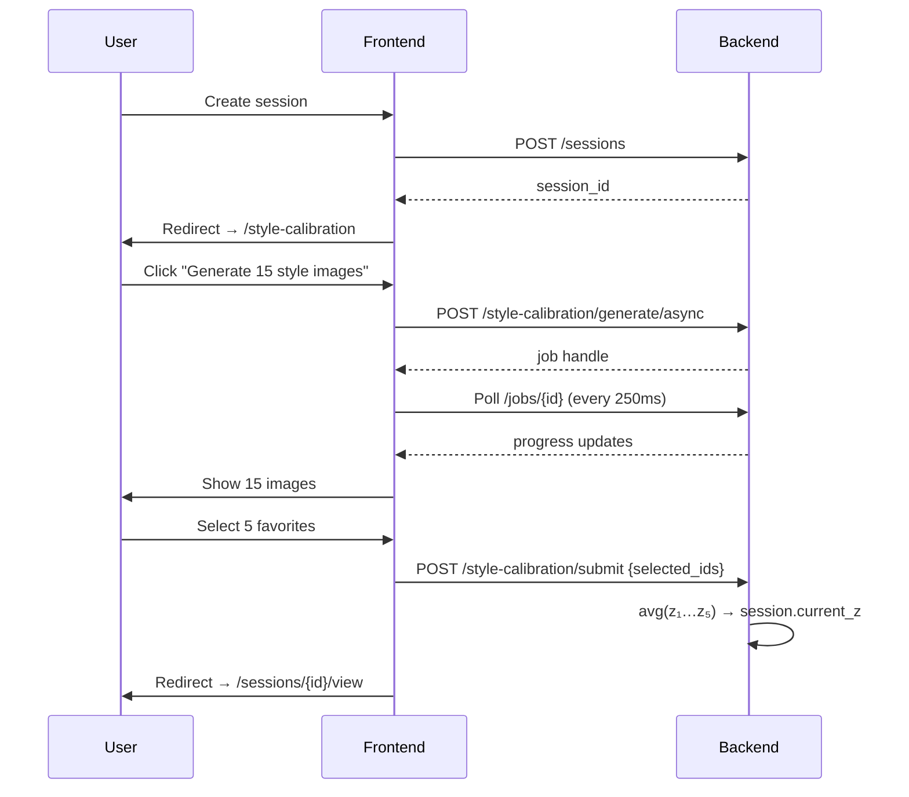
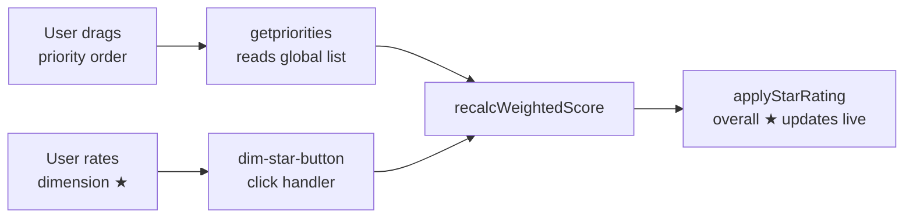
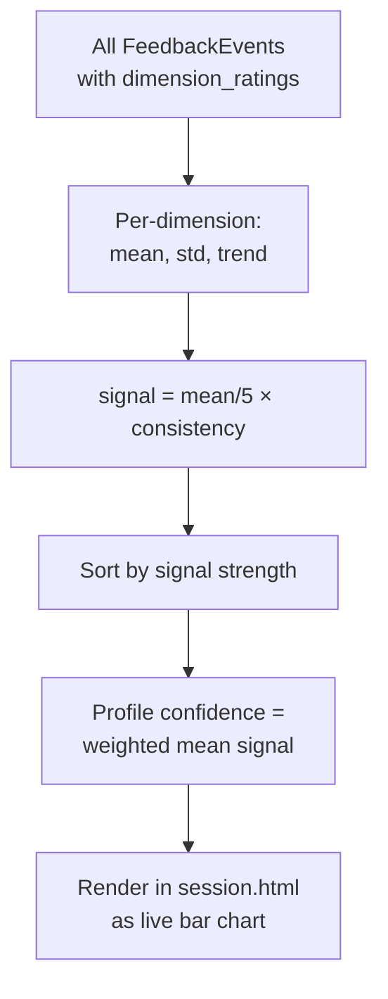

# Year 3 Projects — Student Contribution Report

**Student:** Noam Hadad  
**Date:** June 2026

---

## Overview

This report documents two independent projects completed across two semesters. Both projects share a common thread: using generative AI to improve the quality of a feedback signal — first by generating better training data for a perception model, then by building richer preference-feedback tools for an interactive image-generation system.

| Semester | Project | Repository |
|---|---|---|
| A | WeatherProof-KITTI — Synthetic Adverse-Weather Data | [SyntheticImageData/Weather](https://github.com/NoamHadad2/SyntheticImageData/tree/main/Weather) |
| B | StableSteering — Human-Preference Feedback Features | [StableSteering](https://github.com/NoamHadad2/StableSteering) |

---

## Semester A — WeatherProof-KITTI

[](https://www.python.org/downloads/)
[](https://pytorch.org/)
[](https://github.com/ultralytics/ultralytics)
[](https://colab.research.google.com/)

**Enhancing Object Detection Robustness in Adverse Weather via Latent Diffusion Synthetic Data Augmentation (KITTI Dataset)**

> An end-to-end deep learning pipeline that overcomes the Domain Gap in autonomous driving by generating realistic synthetic harsh-weather training data using SDXL + Dual ControlNet, achieving a **6x reduction** in performance degradation under adverse conditions.

---

### Table of Contents

- [Overview](#overview-1)
- [Pipeline Architecture](#pipeline-architecture)
- [Synthetic Data Examples](#synthetic-data-examples)
- [Model Architecture](#model-architecture)
- [Key Results](#key-results)
- [Dataset](#dataset)
- [Installation](#installation)
- [Repository Structure](#repository-structure)
- [Training](#training)
- [Quick Start](#quick-start)
- [Limitations](#limitations)
- [References](#references)

---

### Overview

#### Problem Statement

Autonomous vehicle perception systems are trained almost exclusively on clear, sunny driving data. When deployed in the real world, these systems must handle rain, snow, fog, and nighttime conditions — creating a **Domain Gap** that causes catastrophic detection failures:

- **Domain Shift**: Weather artifacts (snow, rain streaks, fog haze) corrupt learned feature representations
- **Low Visibility**: Reduced contrast and occluded objects in harsh conditions
- **Safety-Critical Failure**: Missed detections of pedestrians, cyclists, and vehicles directly endanger lives

#### The Data Gap

> **Collecting real adverse-weather driving data at scale is impractical** — it requires dangerous driving conditions, specialized equipment, and extensive manual re-annotation.

This motivates our synthetic data generation approach.

#### Solution

**WeatherProof-KITTI** addresses this by:

1. **Generating synthetic harsh-weather frames** using SDXL inpainting with Dual ControlNet (MiDaS Depth + Canny Edges) conditioning
2. **Preserving spatial geometry** so all original bounding-box annotations remain valid without re-labeling
3. **Training a robust YOLOv8s detector** on the augmented 50/50 mixed dataset

---

### Pipeline Architecture

The research consists of two main pipelines:

#### Pipeline 1: Synthetic Adverse-Weather Generation

This pipeline transforms sunny KITTI driving frames into realistic Snow, Rain, Fog, and Night conditions while preserving all object annotations.


| Step | Component | Description |
|------|-----------|-------------|
| 1 | MiDaS Depth | Monocular depth estimation for 3D scene geometry guidance |
| 2 | Canny Edge | Edge map extraction to preserve object boundaries |
| 3 | SDXL + Dual ControlNet | Weather-conditioned background synthesis |
| 4 | Annotation Transfer | Original bounding boxes remain valid (geometry preserved) |

#### Pipeline 2: Model Training & Robustness Evaluation

This pipeline compares three YOLO models to evaluate the impact of synthetic data augmentation.


| Model | Training Data | Purpose |
|-------|---------------|---------|
| COCO Pretrained | MS-COCO (80 classes) | Baseline reference |
| Original | 5,236 sunny KITTI images | Clear-weather specialist |
| Mixed | 5,236 sunny + 5,236 synthetic | Weather-robust model |

#### Component Summary

| Component | Technology |
|-----------|------------|
| Depth Estimation | MiDaS (Ranftl et al.) |
| Edge Detection | OpenCV Canny |
| Weather Synthesis | SDXL + Dual ControlNet |
| Object Detection | YOLOv8s (Ultralytics) |

---

### Synthetic Data Examples

The generation pipeline transforms sunny KITTI frames into four adverse-weather conditions while preserving all objects and their spatial positions.

<table>
<tr><th>Original (Sunny)</th><th>Synthetic (Harsh Weather)</th></tr>
<tr>
<td></td>
<td></td>
</tr>
<tr>
<td></td>
<td></td>
</tr>
<tr>
<td></td>
<td></td>
</tr>
</table>

---

### Model Architecture

#### Why YOLOv8s (Small)?

The detection backbone is **YOLOv8s (~11.2M parameters)**, deliberately chosen over the lighter YOLOv8n (~3.2M parameters).

**The Capacity Bottleneck Problem:** Initial experiments with YOLOv8n revealed that the model lacked sufficient representational capacity to simultaneously encode features for both clear and adverse-weather domains. Adding synthetic data to a YOLOv8n training set *degraded* sunny-condition performance — the model's limited parameter budget forced a destructive trade-off between domains.

YOLOv8s provides enough capacity to learn **domain-invariant features**, absorbing both sunny and harsh-weather distributions without sacrificing baseline accuracy. In fact, the regularizing effect of the synthetic data caused the Mixed Model to **outperform** the Original Model even on sunny test data.

---

### Key Results

#### Model Performance (mAP@50)

| Model | Training Data | Sunny Test | Mixed Test | Harsh Test |
|-------|---------------|------------|------------|------------|
| COCO Pretrained | MS-COCO | 0.044 | 0.038 | 0.037 |
| Original | 5,236 sunny | 0.801 | 0.508 | 0.222 |
| **Mixed** | **5,236 sunny + 5,236 synth** | **0.815** | **0.767** | **0.718** |

#### The Crash Test

The Original Model (trained on sunny data only) suffers **catastrophic failure** in harsh weather:

| Model | Sunny → Harsh Drop | Harsh mAP@50 |
|-------|---------------------|--------------|
| Original | **-72.3%** | 0.222 |
| **Mixed** | **-11.9%** | **0.718** |

#### Key Findings

1. **Catastrophic Failure**: The Original Model's mAP@50 plummets from 0.801 to 0.222 (-72.3%) in harsh weather — a near-complete detection collapse
2. **Robustness Gain**: The Mixed Model retains mAP@50 = 0.718 in harsh conditions, experiencing only an 11.9% drop — a **6x improvement** in robustness
3. **Breaking the Trade-off**: The Mixed Model **outperforms** the Original even in sunny conditions (0.815 vs. 0.801) thanks to the regularizing effect of synthetic data and the increased capacity of YOLOv8s


#### Robustness Analysis

| Model | Sunny Test | Harsh Test | Drop |
|-------|------------|------------|------|
| Original | 0.801 | 0.222 | **-72.3%** |
| **Mixed** | 0.815 | 0.718 | **-11.9%** |

The Mixed model trained with synthetic data shows **6x better robustness** compared to the Original model.


#### Per-Class Performance on Harsh Weather

| Class | COCO Baseline | Original | Mixed |
|-------|---------------|----------|-------|
| Car | 0.012 | 0.555 | **0.919** |
| Pedestrian | 0.000 | 0.242 | **0.873** |
| Cyclist | 0.003 | 0.334 | **0.929** |
| Van | 0.007 | 0.344 | **0.696** |
| Truck | 0.000 | 0.017 | **0.086** |
| Tram | 0.000 | 0.207 | **0.664** |
| Misc | 0.226 | 0.059 | **0.840** |
| Person_sitting | 0.044 | 0.017 | **0.737** |

The Mixed Model dramatically improves detection of **safety-critical classes** (Car, Pedestrian, Cyclist) by +66%, +261%, and +178% respectively over the Original Model in harsh weather.


---

### Dataset

#### Source

This research uses the **KITTI Vision Benchmark Suite** (Geiger et al., 2012) — the standard benchmark for autonomous driving perception.

#### Dataset Statistics

| Split | Sunny (Original) | Synthetic (Harsh) | Total |
|-------|-------------------|--------------------|-------|
| **Train** | 5,236 | 5,236 | 10,472 |
| **Test** | 748 | 748 | 1,496 |

#### Object Classes

| ID | Class | Safety-Critical |
|----|-------|-----------------|
| 0 | Car | Yes |
| 1 | Pedestrian | Yes |
| 2 | Cyclist | Yes |
| 3 | Van | |
| 4 | Truck | |
| 5 | Tram | |
| 6 | Misc | |
| 7 | Person_sitting | |

#### Synthetic Weather Conditions

| Condition | Description |
|-----------|-------------|
| Rain | Heavy rain with wet road reflections |
| Snow | Snowfall with road snow accumulation |
| Fog | Dense fog with reduced visibility |
| Night | Nighttime with artificial lighting |

---

### Installation

#### Google Colab (Recommended)

```python
!pip install -q ultralytics diffusers transformers accelerate
!pip install -q controlnet_aux

from google.colab import drive
drive.mount('/content/drive')
```

#### Local Setup

```bash
# Clone repository
git clone https://github.com/NoamHadad2/SyntheticImageData.git
cd SyntheticImageData/Weather

# Create environment
conda create -n weatherproof python=3.10 -y
conda activate weatherproof

# Install dependencies
pip install torch torchvision --index-url https://download.pytorch.org/whl/cu118
pip install ultralytics diffusers transformers accelerate controlnet_aux
pip install numpy pandas matplotlib seaborn tqdm
```

#### Requirements

- Python 3.10+
- CUDA 11.8+ (GPU required)
- 16GB+ GPU VRAM recommended (for SDXL generation)

---

### Repository Structure

```
WeatherProof-KITTI/
├── Weather/
│   ├── notebooks/
│   │   ├── 01_KITTI_EDA_DataPrep.ipynb        # Data exploration & YOLO conversion
│   │   ├── 02_Synthetic_Data_Generation.ipynb  # SDXL + ControlNet generation (~6-10 hrs)
│   │   └── 03_YOLOv8s_Training_Evaluation.ipynb # Training & robustness evaluation
│   ├── results/
│   │   ├── figures/                            # Research graphs (4 plots)
│   │   ├── 007321.png ... 007452.png           # Original sample frames
│   │   └── synth_007321.png ... synth_007452.png # Synthetic sample frames
│   └── README.md
├── original_sunny/                             # Original model training outputs
│   ├── weights/best.pt                         # Best checkpoint (~22 MB)
│   ├── results.csv                             # Training metrics
│   ├── confusion_matrix.png                    # Confusion matrices
│   └── BoxPR_curve.png                         # PR curves
├── mixed_weather/                              # Mixed model training outputs
│   ├── weights/best.pt
│   ├── results.csv
│   ├── confusion_matrix.png
│   └── BoxPR_curve.png
├── yaml_configs/                               # YOLO dataset configurations
│   ├── sunny_train.yaml
│   ├── mixed_train.yaml
│   ├── sunny_test.yaml
│   ├── synth_test.yaml
│   └── mixed_test.yaml
└── evaluation_results.json                     # Full metrics (all 9 evaluations)
```

---

### Training

#### Models

| Model | Training Data | Epochs | Img Size |
|-------|---------------|--------|----------|
| COCO Pretrained | MS-COCO (80 classes) | — | — |
| Original | 5,236 sunny KITTI | 50 | 640 |
| Mixed | 5,236 sunny + 5,236 synth | 50 | 640 |

#### Configuration

```python
MODEL      = 'yolov8s.pt'
IMG_SIZE   = 640
BATCH_SIZE = 16
EPOCHS     = 50
PATIENCE   = 10
SEED       = 42
```

---

### Quick Start

#### Run in Google Colab (Recommended)

```python
# 1. Install dependencies
!pip install -q ultralytics diffusers transformers accelerate controlnet_aux

# 2. Mount Drive
from google.colab import drive
drive.mount('/content/drive')

# 3. Run notebooks in order:
#    01_KITTI_EDA_DataPrep.ipynb          → Download KITTI, EDA, YOLO conversion (~20 min)
#    02_Synthetic_Data_Generation.ipynb   → Generate harsh-weather images (~6-10 hours)
#    03_YOLOv8s_Training_Evaluation.ipynb → Train & evaluate models (~3-5 hours)
```

---

### Limitations

- **Noisy Labels / Disappearing Objects**: The generation process occasionally obscures small, distant objects (e.g., far-away pedestrians) due to depth map limitations at extreme ranges. The diffusion model may paint over low-contrast objects in heavy fog or snow. Notably, this **realistically mimics poor visibility** where such objects would indeed be undetectable — and the Mixed Model's strong performance despite these noisy labels demonstrates resilience to imperfect training data.
- Synthetic weather lacks physical simulation (no ray-traced water droplets or volumetric fog)
- Optimized for the KITTI urban driving domain; generalization to other driving datasets requires validation
- Truck and Misc classes have limited representation in the test set, affecting per-class metrics

---

### References

| Reference | Citation |
|-----------|----------|
| **KITTI** | Geiger, A., Lenz, P., & Urtasun, R. (2012). *Are we ready for Autonomous Driving? The KITTI Vision Benchmark Suite.* CVPR. |
| **SDXL** | Podell, D., et al. (2023). *SDXL: Improving Latent Diffusion Models for High-Resolution Image Synthesis.* arXiv:2307.01952. |
| **ControlNet** | Zhang, L., Rao, A., & Agrawala, M. (2023). *Adding Conditional Control to Text-to-Image Diffusion Models.* ICCV. |
| **YOLOv8** | Jocher, G., Chaurasia, A., & Qiu, J. (2023). *Ultralytics YOLOv8.* GitHub. |
| **MiDaS** | Ranftl, R., Bochkovskiy, A., & Koltun, V. (2021). *Vision Transformers for Dense Prediction.* ICCV. |

---

## Semester B — StableSteering: Human-Preference Feedback Features

**Base platform:** [ApartsinProjects/StableSteering](https://github.com/ApartsinProjects/StableSteering) — the supervisor's iterative preference-guided image generation research prototype, forked at [NoamHadad2/StableSteering](https://github.com/NoamHadad2/StableSteering).

### Supervisor's Base Platform — What Existed

The supervisor's platform implements the core steering loop:

> User enters prompt → Stable Diffusion generates candidates → user submits feedback → steering vector `z` is updated → next round starts from the updated `z`

It ships with:
- **5 feedback modes:** `scalar_rating`, `pairwise`, `winner_only`, `approve_reject`, `top_k`
- **10 preference updaters** (winner_copy, Bradley-Terry, softmax, etc.)
- **Async job system** for non-blocking generation
- **SQLite persistence** (sessions, rounds, candidates)
- **Dashboard** showing sessions with "Resume" and "Replay" buttons — no delete

What it does **not** have:
- Any warm-up or calibration before the first round — every session cold-starts at `z = [0,…,0]`
- Per-dimension feedback — the only rating is a single overall star per candidate
- Priority weighting between dimensions
- Any panel showing what the model has learned about the user's taste
- A way to delete sessions

All features below are **strictly additive** — no existing algorithm, updater, sampler, or feedback mode was modified.

### At a Glance

| | Supervisor's base | Our additions |
|---|---|---|
| Session start | Cold-start `z = [0, 0, …, 0]` | Calibrated from 5 user-chosen images |
| Per-candidate feedback | Single overall star rating | Overall star + per-dimension star ratings |
| Dimension weighting | Not supported | Drag-to-rank → live weighted score |
| Preference transparency | Black box | Live Taste Profile: signal strength + trends |
| Session management | Resume / Replay only | + One-click delete |

### System Architecture



---

### Feature 1 — Style Calibration Round

#### Motivation

The supervisor's platform starts every session at `z = [0, 0, …, 0]` with no warm-up mechanism. Round 1 always generates candidates scattered across the full embedding space — many of them in directions the user would immediately reject. There is no way to tell the system anything about preferred style before the loop begins.

#### How It Works

Immediately after session creation, the user is redirected to a calibration page. The system generates **15 candidates** using `spherical_cover` sampler at `trust_radius = 1.0` — the maximum possible spread across the embedding space. The user clicks to select exactly 5 favorites. Their `z` vectors are averaged and set as `session.current_z`, so round 1 starts from an informed position.

```
z_initial = (z_pick1 + z_pick2 + z_pick3 + z_pick4 + z_pick5) / 5
```

The calibration round is stored as `round_index = 0` and filtered out of the regular session view and convergence calculation.



#### Files Changed

| File | Link | Change |
|---|---|---|
| `app/engine/orchestrator.py` | [→](https://github.com/NoamHadad2/StableSteering/blob/main/app/engine/orchestrator.py) | `generate_calibration_round()`, `submit_calibration()` |
| `app/storage/repository.py` | [→](https://github.com/NoamHadad2/StableSteering/blob/main/app/storage/repository.py) | `delete_session()` |
| `app/frontend/templates/style_calibration.html` | [→](https://github.com/NoamHadad2/StableSteering/blob/main/app/frontend/templates/style_calibration.html) | New page: 15-image grid, click-to-select, progress bar |
| `app/main.py` | [→](https://github.com/NoamHadad2/StableSteering/blob/main/app/main.py) | 3 new endpoints: `GET`, `POST /generate/async`, `POST /submit` |
| `app/frontend/static/app.js` | [→](https://github.com/NoamHadad2/StableSteering/blob/main/app/frontend/static/app.js) | Generate + submit handlers, exactly-5 selection enforcement |

---

### Feature 2 — Dimension Rating

#### Motivation

In the supervisor's platform, `scalar_rating` mode gives each candidate a single overall star rating (1–5). This captures *how much* the user prefers an image but tells the updater nothing about *which aspects* drove the score. Two images can both receive 3 stars for completely different reasons — one because the lighting is perfect but the composition is wrong, another the reverse. The updater sees an identical number in both cases and moves `z` in the same direction regardless.

#### How It Works

Prompt dimensions are extracted automatically from the session prompt:

```python
# app/main.py
_STOP_WORDS = {"a","an","the","of","in","on","at","to","and","or",...}
_STYLE_DIMENSIONS = ["lighting", "color", "mood"]

def extract_prompt_dimensions(prompt: str) -> list[str]:
    words = re.findall(r"[a-zA-Z]+", prompt.lower())
    content_dims = [w for w in words if w not in _STOP_WORDS and len(w) > 3][:4]
    return list(dict.fromkeys(content_dims + _STYLE_DIMENSIONS))
```

For `"A cinematic mountain road at sunrise"` this yields: `[cinematic, mountain, road, sunrise, lighting, color, mood]`.

Each candidate card shows a per-dimension star row beneath the overall rating. Ratings are collected as `{ candidate_id: { dimension: score } }` and stored in `FeedbackEvent.dimension_ratings`.

#### Files Changed

| File | Link | Change |
|---|---|---|
| `app/core/schema.py` | [→](https://github.com/NoamHadad2/StableSteering/blob/main/app/core/schema.py) | `+dimension_ratings` on `FeedbackEvent`, `FeedbackRequest` |
| `app/feedback/normalization.py` | [→](https://github.com/NoamHadad2/StableSteering/blob/main/app/feedback/normalization.py) | Pass `dimension_ratings` through to `FeedbackEvent` |
| `app/main.py` | [→](https://github.com/NoamHadad2/StableSteering/blob/main/app/main.py) | `extract_prompt_dimensions()`, inject `prompt_dimensions` into template |
| `app/frontend/templates/session.html` | [→](https://github.com/NoamHadad2/StableSteering/blob/main/app/frontend/templates/session.html) | Per-candidate `.dimension-rating-section` with `dim-star-button` rows |
| `app/frontend/static/app.js` | [→](https://github.com/NoamHadad2/StableSteering/blob/main/app/frontend/static/app.js) | `dim-star-button` handlers, `collectDimensionRatings()` |

---

### Feature 3 — Priority Weighting

#### Motivation

The supervisor's platform has no concept of dimension priority — all aspects of a prompt are treated as equally important. Even with per-dimension ratings (Feature 2), averaging them equally can produce an overall score that contradicts the user's real preferences. A user who cares deeply about `lighting` but is indifferent to `color` should not have those two dimensions count the same toward the final ranking.

#### How It Works

Above the image grid, a **drag-to-rank list** of all prompt dimensions is displayed. The user drags rows into priority order (1 = most important). Whenever a dimension star rating changes *or* the priority order is reordered, the overall star rating for each candidate recalculates live:

```
weight(dim) = N − priority_index      # priority 1 → weight N

weighted_score = Σ(weight(dim) × dim_rating(dim)) / Σ(weight(dim))
```

The overall `★` display updates in real time.



#### Files Changed

| File | Link | Change |
|---|---|---|
| `app/core/schema.py` | [→](https://github.com/NoamHadad2/StableSteering/blob/main/app/core/schema.py) | `+dimension_priorities` on `FeedbackEvent`, `FeedbackRequest` |
| `app/frontend/templates/session.html` | [→](https://github.com/NoamHadad2/StableSteering/blob/main/app/frontend/templates/session.html) | Global `.global-priority-list` drag section above image grid |
| `app/frontend/static/app.js` | [→](https://github.com/NoamHadad2/StableSteering/blob/main/app/frontend/static/app.js) | `getpriorities()`, `recalcWeightedScore()`, drag handlers with live badge renumbering, `collectDimensionPriorities()` |
| `app/frontend/static/styles.css` | [→](https://github.com/NoamHadad2/StableSteering/blob/main/app/frontend/static/styles.css) | `.dimension-row`, `.priority-badge`, `.dimension-row.dragging` |

---

### Feature 4 — Taste Profile

#### Motivation

The supervisor's platform gives the user no visibility into what has been learned. After several rounds, the steering vector `z` has moved based on all the feedback — but the session page shows only a round counter and a list of images. There is no panel that says "the model has noticed you consistently rate `lighting` high and `color` inconsistently." The loop is completely opaque.

#### How It Works

[`app/feedback/taste_profile.py`](https://github.com/NoamHadad2/StableSteering/blob/main/app/feedback/taste_profile.py) processes all `FeedbackEvent.dimension_ratings` from completed rounds:

| Metric | Computation |
|---|---|
| **Mean rating** | Average score given to this dimension across all rounds |
| **Consistency** | `1 − std / 2.5` — low variance → high consistency |
| **Signal strength** | `(mean / 5) × consistency` |
| **Trend** | Compare mean of first-half rounds vs second-half: `↑ growing` / `→ stable` / `↓ declining` |
| **Profile confidence** | Sample-weighted mean signal across all dimensions |



**What the user sees:**

```
Taste Profile                              Profile confidence: 64%
─────────────────────────────────────────────────────────────────
lighting      ████████░░  80%  ↑  growing
composition   ██████░░░░  60%  →  stable
color         ███░░░░░░░  30%  ↓  weak signal
```

The panel appears automatically after the first round with dimension feedback and updates after every submission.

#### Files Changed

| File | Link | Change |
|---|---|---|
| `app/feedback/taste_profile.py` | [→](https://github.com/NoamHadad2/StableSteering/blob/main/app/feedback/taste_profile.py) | **New file** — `compute_taste_profile()`, pure computation |
| `app/main.py` | [→](https://github.com/NoamHadad2/StableSteering/blob/main/app/main.py) | Import + inject `taste_profile` into session template |
| `app/frontend/templates/session.html` | [→](https://github.com/NoamHadad2/StableSteering/blob/main/app/frontend/templates/session.html) | Taste Profile card with bar chart, trend arrows, confidence score |
| `app/frontend/static/styles.css` | [→](https://github.com/NoamHadad2/StableSteering/blob/main/app/frontend/static/styles.css) | `.taste-bar`, `.taste-trend-*`, `.taste-confidence` |

---

### Feature 5 — Delete Session

#### Motivation

The supervisor's dashboard shows all sessions with two actions per row: "Resume session" and "Replay". There is no delete. The repository's `SQLiteRepository` has no `delete_session` method. In a research context, abandoned experiments, misconfigured sessions, and test runs accumulate with no way to clean them up.

#### How It Works

One-click delete button next to each session on the dashboard. Removes the session and all its rounds from the SQLite database immediately, without a page reload.

| File | Link | Change |
|---|---|---|
| `app/storage/repository.py` | [→](https://github.com/NoamHadad2/StableSteering/blob/main/app/storage/repository.py) | `delete_session()` — `DELETE FROM sessions/rounds WHERE id=?` |
| `app/engine/orchestrator.py` | [→](https://github.com/NoamHadad2/StableSteering/blob/main/app/engine/orchestrator.py) | `delete_session()` delegate |
| `app/main.py` | [→](https://github.com/NoamHadad2/StableSteering/blob/main/app/main.py) | `DELETE /sessions/{session_id}` endpoint |
| `app/frontend/templates/index.html` | [→](https://github.com/NoamHadad2/StableSteering/blob/main/app/frontend/templates/index.html) | Delete button per row |
| `app/frontend/static/app.js` | [→](https://github.com/NoamHadad2/StableSteering/blob/main/app/frontend/static/app.js) | Click handler with confirmation dialog, removes row on success |

---

## All Files Changed or Created

### Semester A — [SyntheticImageData/Weather](https://github.com/NoamHadad2/SyntheticImageData/tree/main/Weather)

| File | Purpose |
|---|---|
| [`notebooks/01_KITTI_EDA_DataPrep.ipynb`](https://github.com/NoamHadad2/SyntheticImageData/blob/main/Weather/notebooks/01_KITTI_EDA_DataPrep.ipynb) | Dataset download, EDA, class distribution |
| [`notebooks/02_Synthetic_Data_Generation.ipynb`](https://github.com/NoamHadad2/SyntheticImageData/blob/main/Weather/notebooks/02_Synthetic_Data_Generation.ipynb) | Full generation pipeline |
| [`notebooks/03_YOLOv8s_Training_Evaluation.ipynb`](https://github.com/NoamHadad2/SyntheticImageData/blob/main/Weather/notebooks/03_YOLOv8s_Training_Evaluation.ipynb) | Training + cross-domain evaluation |

### Semester B — [StableSteering](https://github.com/NoamHadad2/StableSteering)

#### New files

| File | Link | Purpose |
|---|---|---|
| `app/feedback/taste_profile.py` | [→](https://github.com/NoamHadad2/StableSteering/blob/main/app/feedback/taste_profile.py) | Taste Profile computation |
| `app/frontend/templates/style_calibration.html` | [→](https://github.com/NoamHadad2/StableSteering/blob/main/app/frontend/templates/style_calibration.html) | 15-image calibration page |
| `app/frontend/templates/calibration.html` | [→](https://github.com/NoamHadad2/StableSteering/blob/main/app/frontend/templates/calibration.html) | Aesthetic style tag selection |

#### Modified files

| File | Link | Change |
|---|---|---|
| `app/core/schema.py` | [→](https://github.com/NoamHadad2/StableSteering/blob/main/app/core/schema.py) | `+dimension_ratings`, `+dimension_priorities` on `FeedbackEvent`, `FeedbackRequest` |
| `app/feedback/normalization.py` | [→](https://github.com/NoamHadad2/StableSteering/blob/main/app/feedback/normalization.py) | Pass new fields through to `FeedbackEvent` |
| `app/engine/orchestrator.py` | [→](https://github.com/NoamHadad2/StableSteering/blob/main/app/engine/orchestrator.py) | `generate_calibration_round()`, `submit_calibration()`, `delete_session()` |
| `app/storage/repository.py` | [→](https://github.com/NoamHadad2/StableSteering/blob/main/app/storage/repository.py) | `delete_session()` |
| `app/main.py` | [→](https://github.com/NoamHadad2/StableSteering/blob/main/app/main.py) | 5 new endpoints, `extract_prompt_dimensions()`, `compute_taste_profile()` |
| `app/frontend/templates/session.html` | [→](https://github.com/NoamHadad2/StableSteering/blob/main/app/frontend/templates/session.html) | Priority section, dimension rating widgets, Taste Profile card |
| `app/frontend/templates/setup.html` | [→](https://github.com/NoamHadad2/StableSteering/blob/main/app/frontend/templates/setup.html) | Aesthetic profile banner, calibration link |
| `app/frontend/templates/index.html` | [→](https://github.com/NoamHadad2/StableSteering/blob/main/app/frontend/templates/index.html) | Delete buttons |
| `app/frontend/static/app.js` | [→](https://github.com/NoamHadad2/StableSteering/blob/main/app/frontend/static/app.js) | All new feature handlers |
| `app/frontend/static/styles.css` | [→](https://github.com/NoamHadad2/StableSteering/blob/main/app/frontend/static/styles.css) | All new component styles |

**No existing algorithms, updaters, samplers, or feedback modes were modified.**
