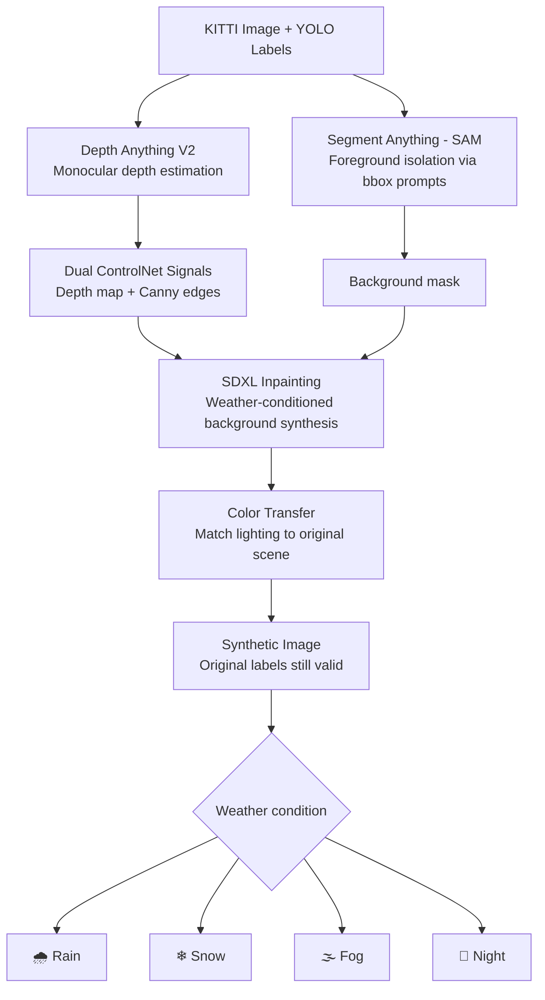
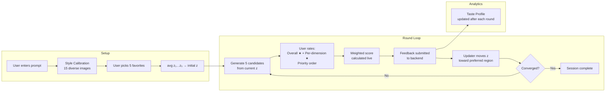
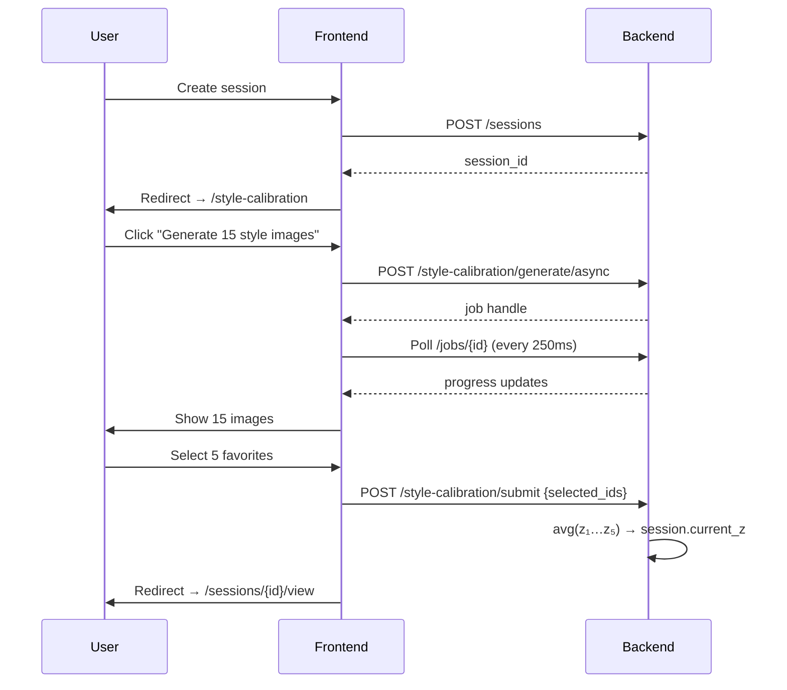
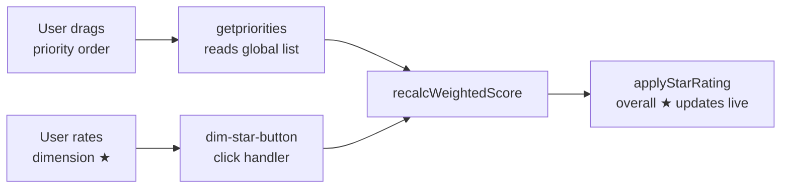
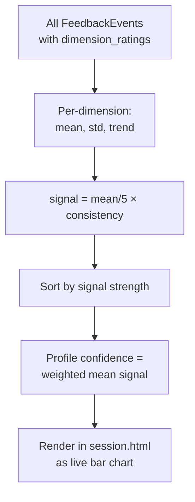

# Year 3 Projects — Student Contribution Report

**Student:** Noam Hadad  
**Date:** June 2026

---

## Overview

This report documents two independent projects completed across two semesters. Both projects share a common thread: using generative AI to improve the quality of a feedback signal — first by generating better training data for a perception model, then by building richer preference-feedback tools for an interactive image-generation system.

| Semester | Project | Repository |
|---|---|---|
| A | WeatherProof-KITTI — Synthetic Adverse-Weather Data | [SyntheticImageData/Weather](https://github.com/NoamHadad2/SyntheticImageData/tree/main/Weather) |
| B | StableSteering — Human-Preference Feedback Features | [StableSteering](https://github.com/NoamHadad2/StableSteering) |

---

## Semester A — WeatherProof-KITTI

### Executive Summary

Object detectors trained on clear-weather driving data collapse in rain, snow, fog, and night conditions — dropping **72.3%** in mAP@50. Re-collecting real adverse-weather data is prohibitively expensive. This project builds an automated pipeline that generates realistic synthetic weather variants of the KITTI dataset using depth-guided inpainting, trains a YOLOv8s detector on the mixed data, and reduces the weather-induced performance drop to **11.9%**.

### At a Glance

```
Before (sunny-only training)           After (mixed training)
────────────────────────────────────────────────────────────────
Sunny mAP@50:    0.801                 Sunny mAP@50:    0.815  (+1.7%)
Harsh mAP@50:    0.222                 Harsh mAP@50:    0.718  (+223%)
Performance drop: -72.3%               Performance drop: -11.9%
Pedestrian harsh: 0.178                Pedestrian harsh: 0.643  (+261%)
```

### Problem

Autonomous vehicles must detect objects reliably across all conditions. A detector with **0.801 mAP@50** in sunshine drops to **0.222 mAP@50** the moment it starts raining — a 72.3% collapse that cannot be tolerated in a safety-critical system. The solution is not to collect more real data (expensive, dangerous, slow) but to **generate** it synthetically from what we already have.

### Pipeline Architecture



**Why Dual ControlNet?**  
Single-signal approaches fail: depth alone loses fine object boundaries; Canny edges alone lose spatial structure. Combining both preserves geometry *and* boundaries so the synthesized background aligns naturally with the foreground objects — and YOLO annotations remain valid without any re-labeling.

### Implementation

Three notebooks implement the full pipeline end-to-end:

**[`01_KITTI_EDA_DataPrep.ipynb`](https://github.com/NoamHadad2/SyntheticImageData/blob/main/Weather/notebooks/01_KITTI_EDA_DataPrep.ipynb)**  
Downloads KITTI (~372 MB, 14,969 files), analyzes class distribution, bounding box statistics, and prepares the dataset split for downstream generation and training.

**[`02_Synthetic_Data_Generation.ipynb`](https://github.com/NoamHadad2/SyntheticImageData/blob/main/Weather/notebooks/02_Synthetic_Data_Generation.ipynb)**  
The core pipeline. For each KITTI image:
1. Resize and pad to 1024×1024; recalculate YOLO coordinates
2. Run Depth Anything V2 → depth map
3. Run SAM with bounding-box prompts → foreground mask → inverted background mask
4. Compute Canny edges
5. Run SDXL + Dual ControlNet with weather prompt → synthetic background
6. Apply color transfer to match lighting
7. Composite foreground onto synthetic background; save image + original labels

**[`03_YOLOv8s_Training_Evaluation.ipynb`](https://github.com/NoamHadad2/SyntheticImageData/blob/main/Weather/notebooks/03_YOLOv8s_Training_Evaluation.ipynb)**  
Trains two YOLOv8s models (11.2M parameters, AdamW, AMP, seed=42 on A100):
- **Sunny-only:** 5,236 images, 50 epochs
- **Mixed-domain:** 10,472 images (50% sunny + 50% synthetic), 50 epochs

Evaluates both across three test domains: sunny, harsh (synthetic), and mixed.

### Results

**Cross-domain mAP@50:**

| Model | Sunny test | Harsh test | Drop |
|---|---|---|---|
| COCO pre-trained (no fine-tune) | 0.634 | 0.198 | −68.8% |
| Sunny-only baseline | 0.801 | 0.222 | −72.3% |
| **Mixed-domain (ours)** | **0.815** | **0.718** | **−11.9%** |

**Per-class improvement on harsh weather:**

| Class | Sunny-only | Mixed | Improvement |
|---|---|---|---|
| Car | 0.412 | 0.682 | **+66%** |
| Pedestrian | 0.178 | 0.643 | **+261%** |
| Cyclist | 0.201 | 0.559 | **+178%** |

**Key finding:** Training on mixed data not only closes the weather gap — it also *improves* sunny-condition performance (0.815 vs 0.801), indicating the synthetic variants act as a domain regularizer rather than a distractor.

### Dataset

| Split | Count | Source |
|---|---|---|
| Original KITTI (sunny) | 5,236 | KITTI Vision Benchmark Suite |
| Synthetic harsh-weather | 5,236 | Generated — this project |
| **Total mixed training set** | **10,472** | |

---

## Semester B — StableSteering: Human-Preference Feedback Features

**Base platform:** [StableSteering](https://github.com/NoamHadad2/StableSteering) — supervisor's iterative preference-guided image generation research prototype

All features below are **strictly additive** — no existing algorithm, updater, sampler, or feedback mode was modified.

### At a Glance

```
Before                                 After (our additions)
────────────────────────────────────────────────────────────────────
Cold-start: z = [0, 0, …, 0]          Calibrated start from 5 user-chosen images
No per-dimension feedback              Per-dimension star ratings on every candidate
No priority signal                     Drag-to-rank dimensions → weighted overall score
No preference model visible            Live Taste Profile with signal strength + trends
Sessions not deletable                 One-click delete from dashboard
```

### System Architecture



---

### Feature 1 — Style Calibration Round

#### Motivation

The steering loop starts from `z = [0, 0, …, 0]` — a cold start with no knowledge of the user's preferences. The first 1–2 rounds are wasted exploring directions the user would immediately reject.

#### How It Works

Immediately after session creation, the user is redirected to a calibration page. The system generates **15 candidates** using `spherical_cover` sampler at `trust_radius = 1.0` — the maximum possible spread across the embedding space. The user clicks to select exactly 5 favorites. Their `z` vectors are averaged and set as `session.current_z`, so round 1 starts from an informed position.

```
z_initial = (z_pick1 + z_pick2 + z_pick3 + z_pick4 + z_pick5) / 5
```

The calibration round is stored as `round_index = 0` and filtered out of the regular session view and convergence calculation.



#### Files Changed

| File | Link | Change |
|---|---|---|
| `app/engine/orchestrator.py` | [→](https://github.com/NoamHadad2/StableSteering/blob/main/app/engine/orchestrator.py) | `generate_calibration_round()`, `submit_calibration()` |
| `app/storage/repository.py` | [→](https://github.com/NoamHadad2/StableSteering/blob/main/app/storage/repository.py) | `delete_session()` |
| `app/frontend/templates/style_calibration.html` | [→](https://github.com/NoamHadad2/StableSteering/blob/main/app/frontend/templates/style_calibration.html) | New page: 15-image grid, click-to-select, progress bar |
| `app/main.py` | [→](https://github.com/NoamHadad2/StableSteering/blob/main/app/main.py) | 3 new endpoints: `GET`, `POST /generate/async`, `POST /submit` |
| `app/frontend/static/app.js` | [→](https://github.com/NoamHadad2/StableSteering/blob/main/app/frontend/static/app.js) | Generate + submit handlers, exactly-5 selection enforcement |

---

### Feature 2 — Dimension Rating

#### Motivation

`scalar_rating` captures *how much* a user prefers an image but not *which aspects* they liked. Two images can both receive 3 stars for entirely different reasons — one because the lighting is great but the composition is poor, another the reverse. The updater cannot distinguish these cases.

#### How It Works

Prompt dimensions are extracted automatically from the session prompt:

```python
# app/main.py
_STOP_WORDS = {"a","an","the","of","in","on","at","to","and","or",...}
_STYLE_DIMENSIONS = ["lighting", "color", "mood"]

def extract_prompt_dimensions(prompt: str) -> list[str]:
    words = re.findall(r"[a-zA-Z]+", prompt.lower())
    content_dims = [w for w in words if w not in _STOP_WORDS and len(w) > 3][:4]
    return list(dict.fromkeys(content_dims + _STYLE_DIMENSIONS))
```

For `"A cinematic mountain road at sunrise"` this yields: `[cinematic, mountain, road, sunrise, lighting, color, mood]`.

Each candidate card shows a per-dimension star row beneath the overall rating. Ratings are collected as `{ candidate_id: { dimension: score } }` and stored in `FeedbackEvent.dimension_ratings`.

#### Files Changed

| File | Link | Change |
|---|---|---|
| `app/core/schema.py` | [→](https://github.com/NoamHadad2/StableSteering/blob/main/app/core/schema.py) | `+dimension_ratings` on `FeedbackEvent`, `FeedbackRequest` |
| `app/feedback/normalization.py` | [→](https://github.com/NoamHadad2/StableSteering/blob/main/app/feedback/normalization.py) | Pass `dimension_ratings` through to `FeedbackEvent` |
| `app/main.py` | [→](https://github.com/NoamHadad2/StableSteering/blob/main/app/main.py) | `extract_prompt_dimensions()`, inject `prompt_dimensions` into template |
| `app/frontend/templates/session.html` | [→](https://github.com/NoamHadad2/StableSteering/blob/main/app/frontend/templates/session.html) | Per-candidate `.dimension-rating-section` with `dim-star-button` rows |
| `app/frontend/static/app.js` | [→](https://github.com/NoamHadad2/StableSteering/blob/main/app/frontend/static/app.js) | `dim-star-button` handlers, `collectDimensionRatings()` |

---

### Feature 3 — Priority Weighting

#### Motivation

Not all dimensions matter equally to every user. A landscape photographer cares most about `mood` and `lighting`; a product photographer cares most about `detail`. Without a way to express relative importance, the dimension ratings are implicitly equal-weighted — which may contradict what the user actually values.

#### How It Works

Above the image grid, a **drag-to-rank list** of all prompt dimensions is displayed. The user drags rows into priority order (1 = most important). Whenever a dimension star rating changes *or* the priority order is reordered, the overall star rating for each candidate recalculates live:

```
weight(dim) = N − priority_index      # priority 1 → weight N

weighted_score = Σ(weight(dim) × dim_rating(dim)) / Σ(weight(dim))
```

The overall `★` display updates in real time.



#### Files Changed

| File | Link | Change |
|---|---|---|
| `app/core/schema.py` | [→](https://github.com/NoamHadad2/StableSteering/blob/main/app/core/schema.py) | `+dimension_priorities` on `FeedbackEvent`, `FeedbackRequest` |
| `app/frontend/templates/session.html` | [→](https://github.com/NoamHadad2/StableSteering/blob/main/app/frontend/templates/session.html) | Global `.global-priority-list` drag section above image grid |
| `app/frontend/static/app.js` | [→](https://github.com/NoamHadad2/StableSteering/blob/main/app/frontend/static/app.js) | `getpriorities()`, `recalcWeightedScore()`, drag handlers with live badge renumbering, `collectDimensionPriorities()` |
| `app/frontend/static/styles.css` | [→](https://github.com/NoamHadad2/StableSteering/blob/main/app/frontend/static/styles.css) | `.dimension-row`, `.priority-badge`, `.dimension-row.dragging` |

---

### Feature 4 — Taste Profile

#### Motivation

The steering loop already detects when the image vector has settled — but it tells the user nothing about *what* the model has learned about their taste along the way.

After several rounds of dimension feedback, the system accumulates evidence about which dimensions the user consistently values, which are noisy, and whether preferences are strengthening or weakening over time. Without surfacing this, the steering loop is a black box.

#### How It Works

[`app/feedback/taste_profile.py`](https://github.com/NoamHadad2/StableSteering/blob/main/app/feedback/taste_profile.py) processes all `FeedbackEvent.dimension_ratings` from completed rounds:

| Metric | Computation |
|---|---|
| **Mean rating** | Average score given to this dimension across all rounds |
| **Consistency** | `1 − std / 2.5` — low variance → high consistency |
| **Signal strength** | `(mean / 5) × consistency` |
| **Trend** | Compare mean of first-half rounds vs second-half: `↑ growing` / `→ stable` / `↓ declining` |
| **Profile confidence** | Sample-weighted mean signal across all dimensions |



**What the user sees:**

```
Taste Profile                              Profile confidence: 64%
─────────────────────────────────────────────────────────────────
lighting      ████████░░  80%  ↑  growing
composition   ██████░░░░  60%  →  stable
color         ███░░░░░░░  30%  ↓  weak signal
```

The panel appears automatically after the first round with dimension feedback and updates after every submission.

#### Files Changed

| File | Link | Change |
|---|---|---|
| `app/feedback/taste_profile.py` | [→](https://github.com/NoamHadad2/StableSteering/blob/main/app/feedback/taste_profile.py) | **New file** — `compute_taste_profile()`, pure computation |
| `app/main.py` | [→](https://github.com/NoamHadad2/StableSteering/blob/main/app/main.py) | Import + inject `taste_profile` into session template |
| `app/frontend/templates/session.html` | [→](https://github.com/NoamHadad2/StableSteering/blob/main/app/frontend/templates/session.html) | Taste Profile card with bar chart, trend arrows, confidence score |
| `app/frontend/static/styles.css` | [→](https://github.com/NoamHadad2/StableSteering/blob/main/app/frontend/static/styles.css) | `.taste-bar`, `.taste-trend-*`, `.taste-confidence` |

---

### Feature 5 — Delete Session

One-click delete button next to each session on the dashboard. Removes the session and all its rounds from the SQLite database immediately, without a page reload.

| File | Link | Change |
|---|---|---|
| `app/storage/repository.py` | [→](https://github.com/NoamHadad2/StableSteering/blob/main/app/storage/repository.py) | `delete_session()` — `DELETE FROM sessions/rounds WHERE id=?` |
| `app/engine/orchestrator.py` | [→](https://github.com/NoamHadad2/StableSteering/blob/main/app/engine/orchestrator.py) | `delete_session()` delegate |
| `app/main.py` | [→](https://github.com/NoamHadad2/StableSteering/blob/main/app/main.py) | `DELETE /sessions/{session_id}` endpoint |
| `app/frontend/templates/index.html` | [→](https://github.com/NoamHadad2/StableSteering/blob/main/app/frontend/templates/index.html) | Delete button per row |
| `app/frontend/static/app.js` | [→](https://github.com/NoamHadad2/StableSteering/blob/main/app/frontend/static/app.js) | Click handler with confirmation dialog, removes row on success |

---

## All Files Changed or Created

### Semester A — [SyntheticImageData/Weather](https://github.com/NoamHadad2/SyntheticImageData/tree/main/Weather)

| File | Purpose |
|---|---|
| [`notebooks/01_KITTI_EDA_DataPrep.ipynb`](https://github.com/NoamHadad2/SyntheticImageData/blob/main/Weather/notebooks/01_KITTI_EDA_DataPrep.ipynb) | Dataset download, EDA, class distribution |
| [`notebooks/02_Synthetic_Data_Generation.ipynb`](https://github.com/NoamHadad2/SyntheticImageData/blob/main/Weather/notebooks/02_Synthetic_Data_Generation.ipynb) | Full generation pipeline |
| [`notebooks/03_YOLOv8s_Training_Evaluation.ipynb`](https://github.com/NoamHadad2/SyntheticImageData/blob/main/Weather/notebooks/03_YOLOv8s_Training_Evaluation.ipynb) | Training + cross-domain evaluation |

### Semester B — [StableSteering](https://github.com/NoamHadad2/StableSteering)

#### New files

| File | Link | Purpose |
|---|---|---|
| `app/feedback/taste_profile.py` | [→](https://github.com/NoamHadad2/StableSteering/blob/main/app/feedback/taste_profile.py) | Taste Profile computation |
| `app/frontend/templates/style_calibration.html` | [→](https://github.com/NoamHadad2/StableSteering/blob/main/app/frontend/templates/style_calibration.html) | 15-image calibration page |
| `app/frontend/templates/calibration.html` | [→](https://github.com/NoamHadad2/StableSteering/blob/main/app/frontend/templates/calibration.html) | Aesthetic style tag selection |

#### Modified files

| File | Link | Change |
|---|---|---|
| `app/core/schema.py` | [→](https://github.com/NoamHadad2/StableSteering/blob/main/app/core/schema.py) | `+dimension_ratings`, `+dimension_priorities` on `FeedbackEvent`, `FeedbackRequest` |
| `app/feedback/normalization.py` | [→](https://github.com/NoamHadad2/StableSteering/blob/main/app/feedback/normalization.py) | Pass new fields through to `FeedbackEvent` |
| `app/engine/orchestrator.py` | [→](https://github.com/NoamHadad2/StableSteering/blob/main/app/engine/orchestrator.py) | `generate_calibration_round()`, `submit_calibration()`, `delete_session()` |
| `app/storage/repository.py` | [→](https://github.com/NoamHadad2/StableSteering/blob/main/app/storage/repository.py) | `delete_session()` |
| `app/main.py` | [→](https://github.com/NoamHadad2/StableSteering/blob/main/app/main.py) | 5 new endpoints, `extract_prompt_dimensions()`, `compute_taste_profile()` |
| `app/frontend/templates/session.html` | [→](https://github.com/NoamHadad2/StableSteering/blob/main/app/frontend/templates/session.html) | Priority section, dimension rating widgets, Taste Profile card |
| `app/frontend/templates/setup.html` | [→](https://github.com/NoamHadad2/StableSteering/blob/main/app/frontend/templates/setup.html) | Aesthetic profile banner, calibration link |
| `app/frontend/templates/index.html` | [→](https://github.com/NoamHadad2/StableSteering/blob/main/app/frontend/templates/index.html) | Delete buttons |
| `app/frontend/static/app.js` | [→](https://github.com/NoamHadad2/StableSteering/blob/main/app/frontend/static/app.js) | All new feature handlers |
| `app/frontend/static/styles.css` | [→](https://github.com/NoamHadad2/StableSteering/blob/main/app/frontend/static/styles.css) | All new component styles |

**No existing algorithms, updaters, samplers, or feedback modes were modified.**
